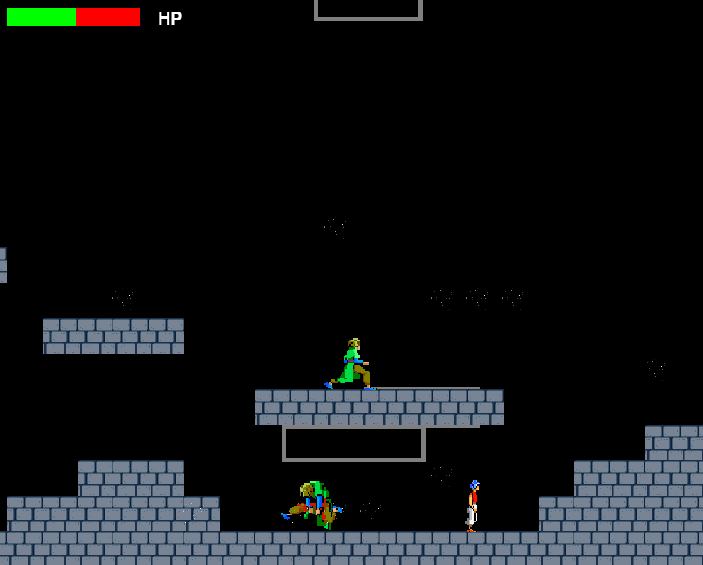

# Prince of Persia - Pygame

This game is inspired by the classic Prince of Persia game. It features a single route that is created based on values stored in a CSV file. Each value in the CSV file represents a different type of tile, allowing for the creation of diverse and complex levels.

The game includes various types of objects such as obstacles, water, decorations, the player, enemies, and the exit. Each of these objects is created based on the tile value in the level data.

The game is written in Python using the Pygame library, which allows for the creation of 2D games.

